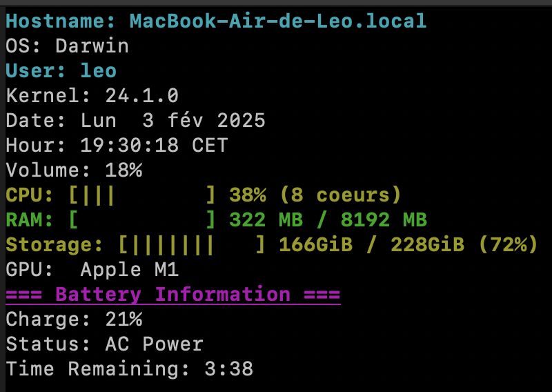
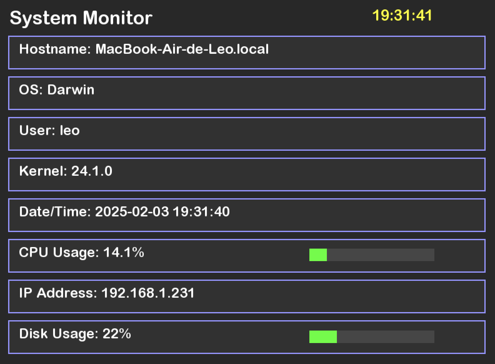

# 🖥️ MyGKrellm

🚀 Un moniteur système inspiré de GNU Krell Monitors (GKrellM), implémenté en C++. Ce programme fournit des informations système en temps réel via des interfaces textuelles (NCurses) et graphiques (SFML).



[Trello](https://trello.com/b/ewpENL7N/rush-3)

## ✨ Fonctionnalités

### 🎯 Fonctionnalités Principales
- 🔌 Architecture modulaire avec affichages et modules interchangeables
- ⚡ Surveillance système en temps réel
- 🎨 Support des modes terminal (NCurses) et graphique (SFML)
- 📚 Système d'empilement dynamique des modules

### 📊 Modules Disponibles
- 👤 Affichage Hostname/Username
- 💻 Informations Système (nom OS et version du kernel)
- 🕒 Date et Heure
- 🔄 Informations CPU
- 💾 Moniteur d'utilisation RAM

### 🎮 Modes d'Affichage
- 📝 Interface texte avec NCurses
- 🖼️ Interface graphique avec SFML

## 📋 Prérequis

### 🛠️ Compilation
- 🔧 G++
- 🔨 Make
- 📚 Bibliothèque SFML
- 📟 Bibliothèque NCurses

## 🏗️ Construction

Le projet utilise un Makefile avec les règles suivantes :

- `make` : Compile le projet
- `make clean` : Supprime les fichiers objets
- `make fclean` : Supprime les fichiers objets et l'exécutable
- `make re` : Recompile le projet depuis zéro

## 🎮 Utilisation

```
./MyGKrellm -ncurses
```
```
./MyGKrellm -sfml
```

### 🎯 Modes d'Affichage
- `s` : Switch entre NCurses et SFML
### 🎛️ Contrôles

#### 📝 Modules NCurses
- `a` : Hostname
- `z` : OS
- `e` : User
- `r` : Kernel
- `t` : Date
- `y` : Hour
- `u` : CPU
- `i` : RAM
- `o` : Network
- `p` : Battery
- `d` : Uptime
- `f` : Volume
- `g` : Storage
- `h` : Process
- `j` : GPU
- `q` : Quitter

#### 🖼️ Mode Graphique (SFML)
- ❌ Bouton fermer pour quitter

## 🏗️ Architecture

Le projet suit une architecture modulaire basée sur deux interfaces principales :

### 🔌 Krell::IModule
- 📐 Interface de base pour tous les modules de surveillance
- 📊 Gère la collecte et le formatage des données
- 🔄 Fournit un accès unifié aux informations des modules

### 🎨 Krell::IDisplay
- 🖼️ Interface de base pour les méthodes d'affichage
- 🎮 Gère le rendu et l'interaction utilisateur
- 🔄 Supporte les backends d'affichage interchangeables (NCurses/SFML)

<br>



## 🔧 Stack Technique

- 💻 C++17
- 🎨 SFML 2.5+
- 📟 NCurses
- 🔨 Make
